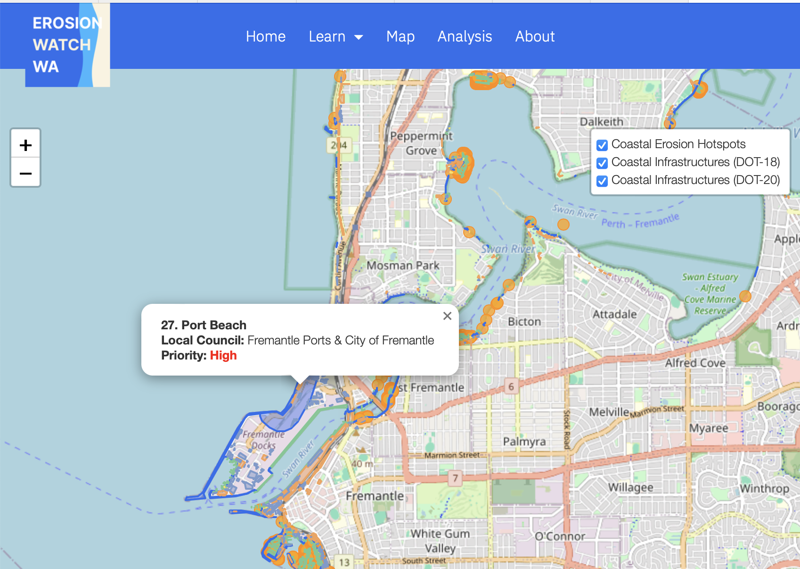

# ErosionWatch-WA 🌊 (Project is currently in development. A live demo or deployment link will be added here once ready...)
**Mapping and Predicting Coastal Erosion Across Western Australia**

ErosionWatch-WA is an interactive, data-driven web application that visualises both historical and predictive coastal erosion across Western Australia. Built using modern geospatial tools, this platform empowers environmentalists, policymakers, urban planners, and the general public to understand and respond to shoreline retreat risks with actionable insights.

---

## Overview

Western Australia’s coastlines are facing an escalating threat from erosion caused by natural forces and human activities. ErosionWatch-WA brings these changes to light through an intuitive mapping interface that:

- Displays historical shoreline retreat using satellite-derived geospatial data
- Maps high-risk public infrastructure
- Predicts future erosion patterns using AI forecasting
- Educates users with accessible erosion information, data analysis and usage guides

This project leverages publicly available datasets from **DataWA**, geospatial APIs, and machine learning to deliver a powerful tool for understanding our dynamic coastlines.

---

## Problem Statement

Coastal erosion in WA is driven by:
- The impact of artificial coastal structures
- Local geomorphological instability
- External processes affecting sediment supply
- Inadequate nearshore protection structures
- Projected sea-level rise

In 2024, WA’s Department of Transport identified **55 erosion hotspots** threatening public/private assets, with an additional 31 locations on a watchlist.

ErosionWatch-WA provides visibility into these regions and aims to assist in planning, adaptation, and awareness.

---

## Technologies Used

- **Leaflet.js** – Interactive maps
- **GeoPandas** – Spatial data processing
- **Flask** – Backend web framework
- **Machine Learning (Scikit-learn)** – Forecasting erosion trends
- **DataWA & DEA APIs** – Official government geospatial data

---
Created by Kamleshkumar Senthilkumar
